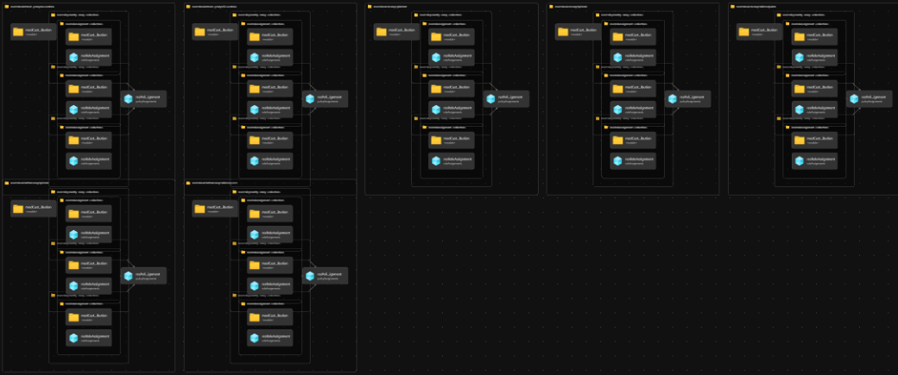

# Module: ALZ Custom / Additional Policy Assignments

This module deploys any additional and custom Azure Landing Zone Azure Policy Assignments to the Management Group Hierarchy in DoNotEnforce/Audit mode. This also assigns the relevant RBAC for the system-assigned Managed Identities created for policies that require them (e.g., DeployIfNotExist & Modify effect policies).

The module was put together to mitigate against the compiled ARM template limit of 4MB. The existing (infra-as-code/bicep/modules/policy/assignments/alzDefaults/alzDefaultPolicyAssignments.bicep) is already very close to the limit of a compiled output of 4MB, with just a couple of additional existing policy definitions wanting to be assigned to additional management groups triggering the exception message: -
``` RequestContentTooLarge - The request content size exceeds the maximum size of 4 MB. ```

The issue is described in more detail within the [Adding Custom Azure Policy Definitions](https://github.com/Azure/ALZ-Bicep/wiki/AddingPolicyDefs), and more specifically the [Handling a large amount of additional custom Policy Definitions](https://github.com/Azure/ALZ-Bicep/wiki/AddingPolicyDefs#handling-a-large-amount-of-additional-custom-policy-definitions) sections of this documentation.

## Parameters

- [Parameters for Azure Commercial Cloud](generateddocs/workloadSpecificPolicyAssignments.bicep.bicep.md)

## Outputs

The module does not generate any outputs.

## Deployment

> For the examples below we assume you have downloaded or cloned the Git repo as-is and are in the root of the repository as your selected directory in your terminal of choice.

### Azure CLI

```bash
# For Azure global regions

dateYMD=$(date +%Y%m%dT%H%M%S%NZ)
NAME="alz-alzCustomPolicyAssignments-${dateYMD}"
LOCATION="eastus"
MGID="alz"
TEMPLATEFILE="infra-as-code/bicep/modules/policy/assignments/customPolicyAssignments/customPolicyAssignments.bicep"
PARAMETERS="@infra-as-code/bicep/modules/policy/assignments/customPolicyAssignments/parameters/customPolicyAssignments.parameters.all.json"

az deployment mg create --name ${NAME:0:63} --location $LOCATION --management-group-id $MGID --template-file $TEMPLATEFILE --parameters $PARAMETERS
```

### PowerShell

```powershell
# For Azure global regions

$inputObject = @{
  DeploymentName        = -join ('alz-alzCustomPolicyAssignmentsDeployment-{0}' -f (Get-Date -Format 'yyyyMMddTHHMMssffffZ'))[0..63]
  Location              = 'eastus'
  ManagementGroupId     = 'alz'
  TemplateFile          = "infra-as-code/bicep/modules/policy/assignments/customPolicyAssignments/customPolicyAssignments.bicep"
  TemplateParameterFile = 'infra-as-code/bicep/modules/policy/assignments/customPolicyAssignments/parameters/customPolicyAssignments.parameters.all.json'
}

New-AzManagementGroupDeployment @inputObject
```

## Bicep Visualizer


